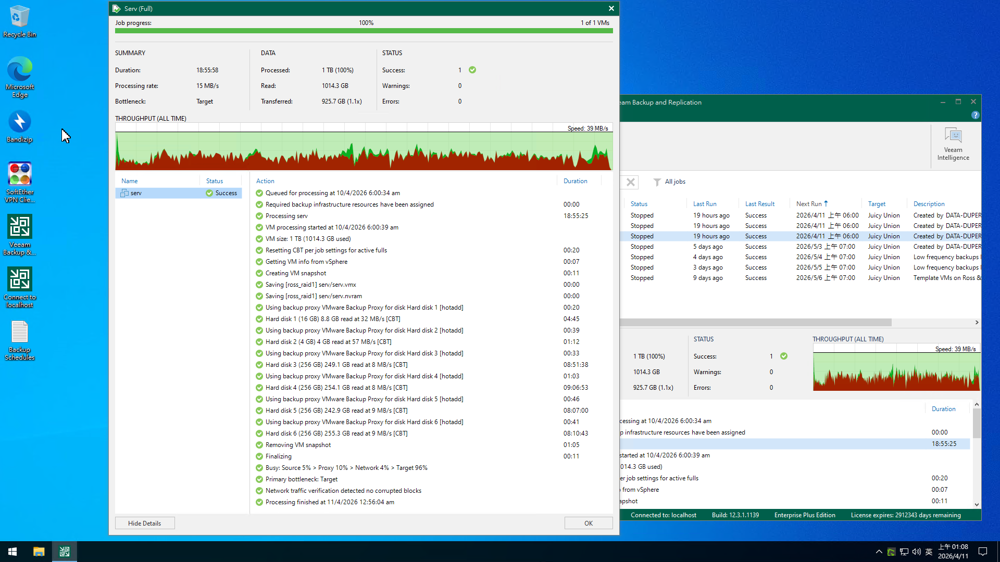
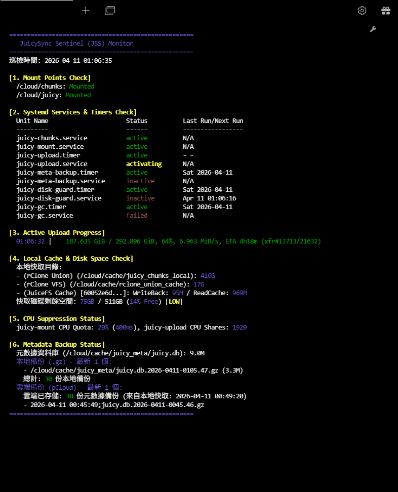
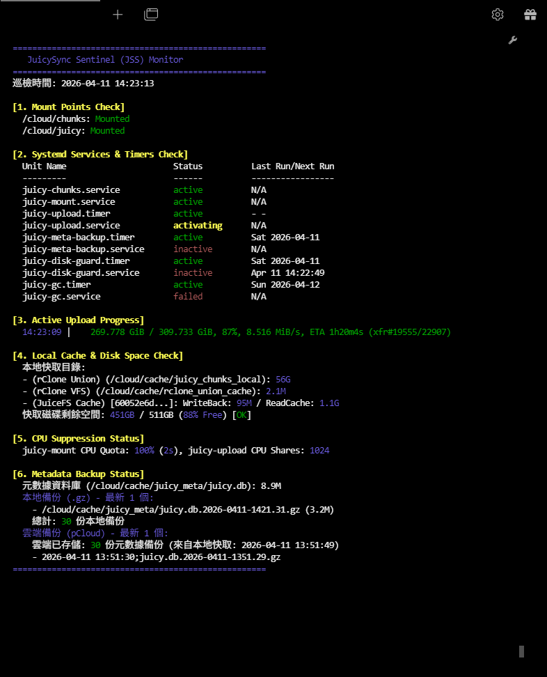

# JuicySyncSentinel
JuicySync Sentinel 是一套基於 JuiceFS 與 Rclone 的雲端存儲掛載方案，面向 pCloud 10T 做為備份空間，利用 512G 本地空間，應付 Veeam Backup &amp; Replication 單次備份達 1T 以上的 VM。以最少的成本做到企業級的功能。

由於 pCloud 的 Client，寫入多大的檔案就要有多大暫存空間，對於備份系統不切實際，所以需要一個中繼伺服器做為暫存。
而 pCloud 上傳速度有限，最高 12MB/sec, 均速 8MB/sec, Veeam 無法直接對接 pCloud，備份檔無法分割，也無法限速，讀多少，網路頻寬有多少，就寫多少出去，很容易就把中繼伺服器寫爆，檔案大小也是大問題。
所以中繼伺服器配置 JuiceFS, 用來將檔案切割為 16MB chunk, 利用 rClone 傳輸到 pCloud，並且依照空間剩餘量，調整 JuiceFS 的 process 的 CPUQuota 與 CPUShares 以平衡「寫入速度」與「上傳能力」，這樣的配置可以應付 1T 的 VM 備份。缺點是由於 pCloud 端的備份檔儲存的是 Chunk 碎塊，無法直接使用，必須透過 JuiceFS 才能還原檔案。

我的 1T VM 備份總讀取時間 24 小時，再 12 小時可完全上傳完畢，共 36 小時完成 1T VM 備份，符合均速 8MB/sec 的 pCloud 上傳頻寬。

中繼伺服器硬體配置：6 cores, 4G RAM, 4G Swap, 512G HDD, AlmaLinux 9 minimal installation. 由於 JuiceFS 開啟壓縮，故核心數配置較多。

初始化 JuiceFS 資料庫指令：
```text
/usr/local/bin/juicefs format \
    --storage file \
    --bucket /cloud/chunks \
    --block-size 16384 \
    --compress lz4 \
    --trash-days 0 \
    sqlite3:///cloud/cache/juicy_meta/juicy.db \
    juicy-chunks
```

2026年某時間後，不知為何，juicy-gc 無法對 pcloud 做刪除 Trash 的動作，尚未深究原因。必須上 pCloud 手動刪除 Trash，否則時間一久，Trash 被塞爆會造成 pCloud 網頁打不開，就要找 pCloud 客服處理了。

## 螢幕截圖
# Windows, Veeam


# Linux, jstat


# Linux, jstat


以上是人類寫的

---
以下99.9趴都是 AI 寫的，包含所有系統檔案，名字也是AI取的。文件可能詞不達意，畢竟是AI，系統檔都是部署運作中，都沒問題。

這是為您量身打造的 **JuicySync Sentinel** 系統說明文件，專門針對 AlmaLinux 9 環境與 Veeam Backup & Replication 儲存需求進行優化。

---

# JuicySync Sentinel 系統說明文件

**JuicySync Sentinel** 是一套高效能、具備自我資源調節能力的雲端存儲掛載方案。它結合了 **JuiceFS** 的強大元數據管理與 **Rclone Union** 的本地/雲端混合特性，專為處理大型虛擬機備份（單一可達 1TB）而設計，能將 512GB 的有限本地磁碟轉化為高達 10TB 的 pCloud 備援空間。

## 一、 整體功能說明

1.  **高效能混合寫入**：透過 Rclone Union 的 `epff` 策略，所有備份寫入操作均先在本地 SSD（`/cloud/cache/juicy_chunks_local`）完成，確保 Veeam 備份任務不因網路延遲而中斷。
2.  **非同步背景上傳**：系統每 20 秒自動將本地緩存的數據塊移至 pCloud，實現「即時寫入、背景同步」。
3.  **動態資源護衛 (Disk Guard)**：針對 512GB 本地硬體的限制，系統會動態監控剩餘空間。當空間低於 50GB 時，會自動調低 JuiceFS 的 CPU 配額並提高上傳服務的優先權，防止磁碟寫滿導致系統崩潰。
4.  **元數據多層保護**：JuiceFS 的元數據存儲於 SQLite，每 5 分鐘自動進行一次 WAL Checkpoint 並備份至雲端，確保在硬體損壞時能快速恢復 10TB 的數據結構。
5.  **支援大容量備份**：憑藉 JuiceFS 的 `writeback` 模式與分塊機制，即使本地磁碟僅 512GB，也能應付單一 1TB 以上的 VM 備份任務。

---

## 二、 功能方塊圖

```text
[ Veeam Backup & Replication ] (data rate 100 MB/s max)
           | (POSIX Mount)
           v
+---------------------------------------+ (FUSE 介面)
|      JuiceFS 掛載點 (/cloud/juicy)     | <--- [ SQLite Metadata (juicy.db) ]
+---------------------------------------+        (每5分鐘備份至雲端)
           | (Chunking 16MB)
           v
+---------------------------------------+
|      Rclone Union (/cloud/chunks)     |
|     (策略: 優先寫入本地, 讀取透明合併)  |
+---------+-------------------+---------+
          |                   |
          v                   v
[ 本地寫入緩衝區 ]  ----(20s)---> [ pCloud 遠端儲存 ] <-- (最終存放 Chunks)
(512GB 空間管理)   [rclone move]  (10TB 總容量)
```

---

## 三、 各檔案功能說明

### 1. 核心掛載服務
*   **`juicy-mount.service`**：主服務，負責啟動 JuiceFS 並管理所有定時器的生命週期。它使用 `writeback` 模式加速寫入，並依賴 SQLite 作為元數據引擎。
*   **`juicy-chunks.service`**：利用 Rclone 將本地緩存目錄與 pCloud 合併為一個統一的 `/cloud/chunks` 路徑供 JuiceFS 使用。
*   **`rclone.conf`**：定義雲端連線參數與 Union 策略，確保資料流向正確（先在地，後雲端）。

### 2. 資料調度與空間保護
*   **`juicy-upload.service` & `.timer`**：核心數據移動器，每 20 秒執行一次，將超過 10 秒的數據塊由本地移往雲端。
*   **`juicy-disk-guard.service` & `.timer`**：**針對 512GB 本地硬體的關鍵保護裝置**。每分鐘檢測空間，動態調整 CPUQuota 與 CPUShares 以平衡「寫入速度」與「上傳能力」。

### 3. 維護與備份
*   **`juicy-meta-backup.service` & `.timer`**：每 5 分鐘執行一次。執行 `wal_checkpoint` 確保 SQLite 數據完整，壓縮後同步至 pCloud，本地與雲端各保留 30 份副本。
*   **`juicy-gc.service` & `.timer`**：每日凌晨 3:00 執行。清理 JuiceFS 垃圾資料、壓縮 SQLite (VACUUM) 並清理雲端暫存檔。

### 4. 監控
*   **`juicy_status`**：顯示目前狀態。
*   **`jstat`**：利用 linux watch 每秒一次更新顯示目前狀態。

---

## 四、 部署方式 (AlmaLinux 9)

### 1. 基礎環境安裝
```bash
# 安裝 FUSE 與必要工具
sudo dnf install fuse3 sqlite gzip -y
# 安裝 JuiceFS 與 Rclone (請至官網下載對應版本二進位檔)
```

### 2. 配置路徑與權限
```bash
# 建立必要目錄
sudo mkdir -p /cloud/juicy /cloud/chunks /cloud/cache/juicy_meta /cloud/cache/juicy_chunks_local /var/log/rclone
# 確保路徑權限 (建議以 root 或特定服務帳號運行)
```

### 3. 部署配置文件
1.  將 `rclone.conf` 內容置於 `~/.config/rclone/rclone.conf`。
2.  將所有 `.service` 與 `.timer` 檔案複製到 `/etc/systemd/system/` 目錄。

### 4. 啟動系統
```bash
# 重新載入 Systemd 設定
sudo systemctl daemon-reload

# 啟動主服務 (這會自動拉起 chunks 服務與所有計時器)
sudo systemctl enable --now juicy-mount.service

# 檢查狀態
df -h /cloud/juicy
systemctl list-timers "juicy*"
```

### 5. Veeam 設定建議
在 Veeam 控制台中，將 `/cloud/juicy` 新增為 **Linux Backup Repository**。由於本系統具備動態資源調節與緩存機制，建議 Veeam 的併發任務數 (Concurrent tasks) 設為 **4**，以配合伺服器的 6 核心配置。
